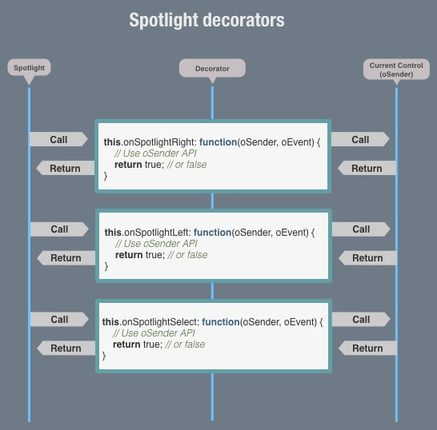

# SPOTLIGHT DOCUMENTATION #

1. [What is Spotlight?](#1)
2. [Modes](#2)
3. [Navigation](#3)
4. [Containers](#4)
5. [Nesting](#5)
6. [Events](#6)
	1. [Spotlight events list](#6_1)
	2. [Preventing/Allowing default DOM events](#6_2)
	3. [Sequence of Spotlight events](#6_3)
	4. [Accelerated keydown events](#6_4)
7. [Extending Spotlight](#7)
	1. [Spotlight Decorators](#7.1)
	2. [Extending controls](#7.2)

## 1. WHAT IS SPOTLIGHT? ##

Spotlight is an extensible utility that enables users to navigate Enyo
applications using a keyboard or television remote control.  Responding to input
from the **UP**, **DOWN**, **LEFT**, **RIGHT**, and **RETURN** keys, Spotlight
provides a navigation experience that compares favorably to that of a mouse on a
computer.

In addition, Spotlight includes support for Point-and-Click events, so all bases
are covered.

To add **[Spotlight](kind.Spotlight.js)** to an application, simply include the
**Spotlight** package and add a spotlight control as a top-level component in
the app:

    enyo.kind({
        name: 'App',
        kind: 'FittableRows',   
        components:[   
            {kind: 'enyo.Spotlight', defaultControl: 'list1'},
            ...
        ],
        ...
    })

## 2. MODES: ##

**[Spotlight](kind.Spotlight.js)** functions in two mutually exclusive modes: **5-way** and **Pointer** mode.
Currently it is configured to switch between modes whenever corresponding input is received. I.e. it switches to pointer mode on mousemove, and back to 5-way on keydown.
However, **[Spotlight](kind.Spotlight.js)** API provides a way to explicitly perform the switch by calling 

> `Enyo.Spotlight.setPointerMode([BOOLEAN]);`

## 3. NAVIGATION: ##

**[Spotlight](kind.Spotlight.js)** allows navigation between Enyo controls by setting spotlight focus to one control at a time. 
When control is focused, it is assigned a CSS class ".spotlight" which allows to style focused controls on per-kind basis using `.<kindClass>.spotlight` selectors.

In order to make a control focusable with **[Spotlight](kind.Spotlight.js)** ( **Spottable** ), simply set it's "spotlight" property to TRUE, like so:

> `{name: 'mybutton', tag: 'button', spotlight: true}`
	
When application loads, spotlight searches for a control name specified by it's **defaultControl** property, 
if defaultControl is not specified, spotlight focuses on the first available spottable control.

In 5-way mode, spotlight uses [Nearest Neighbor Algorithm](kind.Spotlight.NearestNeighbor.js) to determine what spottable control is nearest in the direction of navigation. 
The coordinates of spottable controls are derived from their actual position on the screen.

It's worth noting, that spottable controls don't have to be found on the same hierarchal level of an Enyo component tree. 
**[Spotlight](kind.Spotlight.js)** takes care of allowing seamless navigation between topmost spottable components found in the tree.

## 4. CONTAINERS: ##

In order to organize controls into navigation groups we have created Spotlight containers. 
A good use case for containers is a set of radio buttons that need to be navigable independently from the rest of controls.

When Spotlight container is focused it passes the focus to it's own hierarchy of spottable child controls, 
namely to the spottable child, which has been focused last before the focus has moved outside of the container.
If the container in question has never been focused, it focuses it's first spottable child.

To define a container, set control's `spotlight` property to "container":

> `{name: 'mycontainer', spotlight: 'container', components: [<A LIST OF spotlight:true CONTROLS>]}`
	
In a way, containers are the branches and `spotlight:true` controls are the leaves of **[Spotlight](kind.Spotlight.js)** navigation tree.
	

## 5. NESTING ##

The containers can be nested. The inner containers can be remembered by outer as their "last focused children", and act as conduits of focus passed by the outer ones.

Nesting `spotlight:true` controls was not found useful. 
As of now, they act as the leaves of the spottable tree and don't conduct focus, however this behavior can be overridden on per-control basis. 

## 6. EVENTS ##

All spotlight events are dispatched directly to the currently spotted control, where they can be prevented from bubbling to define custom behavior. (See [Extending Spotlight](#7) section)
If spotlight events are allowed to bubble to the application level, the **[Spotlight](kind.Spotlight.js)** responds to them with default behavior.

 

### 6.1. Spotlight events list ###

The events dispatched by main **[Spotlight](kind.Spotlight.js)** module are:
> ### 5-way mode: ###
>
> 1. **onSpotlightKeyDown** - dispatched in response to keydown
>
> 2. **onSpotlightKeyUp** - dispatched in response to keyup
> 
> 3. **onSpotlightLeft** - dispatched in response to onSpotlightKeyDown bubble to app level with keyCode 37
> 
> 4. **onSpotlightRight** - dispatched in response to onSpotlightKeyDown bubble to app level with keyCode 39
> 
> 5. **onSpotlightUp** - dispatched in response to onSpotlightKeyDown bubble to app level with keyCode 38
> 
> 6. **onSpotlightDown** - dispatched in response to onSpotlightKeyDown bubble to app level with keyCode 40
> 
> 7. **onSpotlightSelect** - dispatched in response to onSpotlightKeyDown bubble to app level with keyCode 13
> 
> 8. **onSpotlightFocus** - dispatched when focus is being transferred to new control in response to events 3-8
> 
> 9. **onSpotlightBlur** - dispatched when focus is transferred away from a control
> 
> 10. **onSpotlightFocused** - dispatched in response to onSpotlightFocus bubble to app level right after it's originator is set as current
>
> ### Pointer mode: ###
>
> 1. **onSpotlightPoint** - dispatched in response to mousemove with coordinates matching bounds of spottable control
>
> 2. **onSpotlightScroll** - TBD    

      

### 6.2. Preventing/Allowing default DOM events ###

By default, if keydown event carries 5-way keyCode (13, 37, 38, 39 or 40), it is prevented from bubbling to trigger default browser behavior. 
This has been done to disable default browser scrolling, because in presence of **[Spotlight](kind.Spotlight.js)**, scrolling is handled otherwise using components like Scroller.
Of course, there are other cases where you may want the default behavior to happen. 
For example, in text inputs, moving cursor to the next character when right arrow key is depressed, may not require interference from JavaScript. 

For cases like that, there is a **Allow DOM default** feature.
Events **onSpotlightKeyDown**, **onSpotlightLeft**, **onSpotlightRight**, **onSpotlightUp**, **onSpotlightDown** and **onSpotlightSelect** supply to their handlers an event with added `allowDomDefault` method:

>	`onSpotlightKeyDown: function(oSender, oEvent) {`   
>	&nbsp;&nbsp;&nbsp;&nbsp;`oEvent.allowDomDefault();`   
>	`}`

If the above handler, if the spotlight event is allowed to propagate, it will allow the original DOM keydown to trigger default browser behavior. See [Figure A](#A).   
   

### 6.3. Sequence of Spotlight events ###

Figure A
--------

Following [Figure A](#A), **[Spotlight](kind.Spotlight.js)** 5-way mode events are following a sequence each step of which can be modified/prevented on the currently focused control level (See [Extending Spotlight](#7) section).

For an instance, when `onSpotlightKeyDown` is dispatched to focused control, the control has a choice to prevent it from ever reaching the App level where it would be handled by **[Spotlight](kind.Spotlight.js)**, and replace the default behavior with custom.

If, however, `onSpotlightKeydown` is allowed to propagate and the **[Spotlight](kind.Spotlight.js)** recognizes it's keyCode as one of 5-way key codes, it dispatches `onSpotlight<5-Way Direction>` event back to the focused control.
At this point, the control has, yet again, the option of overriding default behavior.

If `onSpotlight<5-Way Direction>` event bubbles up to App level, **[Spotlight](kind.Spotlight.js)** employs it's [Nearest Neighbor Algorithm](kind.Spotlight.NearestNeighbor.js) to figure out what spottable control is closest in the `<5-Way Direction>`. 
It dispatches `onSpotlightBlur` (while removing CSS *.spotlight* class) to the current control, and `onSpotlightFocus` to the neighbor in question (while adding CSS *.spotlight* class to it).

If `onSpotlightFocus` is allowed to bubble from the newly focused control, **[Spotlight](kind.Spotlight.js)** set's it's originator as **current**, and it officially becomes focused control. 
In celebration of this fact, **[Spotlight](kind.Spotlight.js)** dispatches `onSpotlightFocused` to the control.   

 

### 6.4. Accelerated keydown events ###

Figure B
--------

While key is depressed, browser dispatches keydown events with equal (or nearly equal) intervals.

Following [Figure B](#B), we can see that not all of them affect application.
Function of [Spotlight Accelerator](kind.Spotlight.Accelerator.js) is to distribute events in time per it's configuration.

[Spotlight Accelerator](kind.Spotlight.Accelerator.js) can be configured via it's array property `enyo.Spotlight.Accelerator.frequency`.
It's default configuration is:

> `//* Firing configuration. At n-th second use every frequency[n] subsequent keydown event`    
> frequency	: [3, 3, 3, 2, 2, 2, 1], ...   
 
This commands [Accelerator](kind.Spotlight.Accelerator.js) the following:

* On 1st, 2nd and 3rd second after key is depressed, only allow through every 3rd keydown event
* On 4th, 5th and 6th second - allow every 2nd keydown event
* On 7th and on second - allow every keydown event

This creates an appearance of Spotlight focus moving on the screen with acceleration while 5-way key is depressed.

## 7. EXTENDING SPOTLIGHT ##

There are two ways to extend spotlight functionality: using [Spotlight Decorators](#7.1) or [Extending existing controls](#7.2).

Each of the two has it's own pros and cons. Historically, we needed pros of both, so both were implemented.

 

### 7.1. Spotlight Decorators ###

Spotlight decorators is a way to add spotlight functionality to a control without altering it's code. 
This approach is useful when one or more of the following is true:

* You don't have access to alter control's code
* You prefer not to extend control
* You want to share same spotlight-related code among multiple kinds

 
**Steps to create and apply a decorator to a kind:**

1. Create a *`kind.Spotlight.Decorator.<My-Decorated-Kind>.js`* file  
2. Place this file into */decorators* folder inside of *spotlight* package
3. Add a line with your new filename to */decorators/package.js* file to create a dependency
4. In the file create a decorator kind:  
> `name: enyo.Spotlight.Decorator.<My-Decorated-Kind>,`  
5. Add `statics` block to write the rest of your code in it
6. Add static property *decorates* :   
> `decorates: My-Decorated-Kind,`  

7. Add event handler function with exactly the same name as a Spotlight event you wish to handle:
> `onSpotlightFocused: function(oSender, oEvent) { console.log(oSender, oEvent); },`   
8. Around your decorator you may add an *if* statement checking for *My-Decorated-Kind* being present in scope to avoid null reference exceptions:
> `if (window.onyx && onyx.<My-Decorated-Kind>) { /* decorator code */ }`

  
When you run your code and focus your desired control, you should see console entries with an instance of the control (oSender) and `onSpotlightFocused` event instance (oEvent)

Figure C
--------

Having a reference of control inside of event handler's scope allows you to access it's API and change it's state as desired in response to the event.
Just like in a regular event handler, returning TRUEish values will prevent it's default behavior defined in **[Spotlight](kind.Spotlight.js)**

If you need to persist a state of control between event handler calls you can use `oSender._spotlight` property object which is added by **[Spotlight](kind.Spotlight.js)** to every control it decorates:
> `oSender._spotlight.focusedTimes ++;`  

Please refer to **[existing Spotlight decorators](decorators)** package for samples.

 

### 7.2. Extending controls ###

Extending enyo controls to use **[Spotlight](kind.Spotlight.js)** functionality does not require any knowledge beyond enyo inheritance patterns and all described above in this document.
To do so, you simply subkind the kind you want to extend and define event handlers to handle spotlight events.
Please refer to **[Moonraker](https://github.com/enyojs/moonraker)** package for samples.

